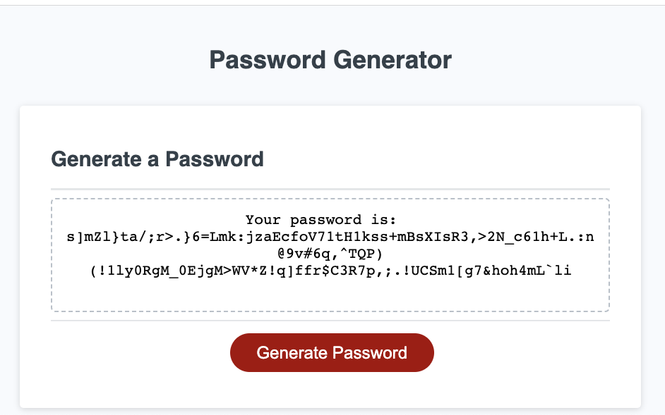

# password-generator

---

## Technology Used 

| Technology Used         | Resource URL           | 
| ------------- |:-------------:| 
| HTML    | [https://developer.mozilla.org/en-US/docs/Web/HTML](https://developer.mozilla.org/en-US/docs/Web/HTML) | 
| CSS     | [https://developer.mozilla.org/en-US/docs/Web/CSS](https://developer.mozilla.org/en-US/docs/Web/CSS)      |
| JavaScript     | [https://developer.mozilla.org/en-US/docs/Web/JavaScript](https://developer.mozilla.org/en-US/docs/Web/JavaScript)      |   
| Git | [https://git-scm.com/](https://git-scm.com/)     |    

---

## Description

[Visit the Deployed Site](https://jeffreydne.github.io/password-generator)

The user inputs the number of characters &amp; what types of characters are desired in order to get a randomly generated password.


---

## Code Example

The below JavaScript example shows how I use the prompt method to let a user input 'yes' or 'no' after reading the statement directing them to state whether or not they want to use lower case letters in their random password. I then use an if statement to make sure they have actually entered either 'yes' or 'no'. If not an alert is displayed telling them they must do so and the prompt is then repeated. If they do enter yes, then the string "lowCase" is pushed into the empty array which was declared at the top of this code snippet. This code block is then repeated for the other 3 possible types of characters to use which are upper case letters, numbers, and special characters. At the end of these 4 blocks of code there will be an array that includes a string representing each of the character types that the users wants to use in their random password.

```JS
      const typeCharArr = [];
    //ask if lower case characters are desired
    let lowCase = prompt("Please type 'yes' or 'no' in all lower case letters: Do you want your password to include lower case letters?");
    if (lowCase !== "yes" && lowCase !== "no") {
      alert("Please type you answer using only lower case letters and it must be exactly yes or exactly no. It cannot contain spaces or other characters. ")
      lowCase = prompt("Please type 'yes' or 'no' in all lower case letters: Do you want your password to include lower case letters?");
    } 
    // I did not do an "else if" here because that resulted in a bug when user inputs an incorrect answer
    if (lowCase === "yes") {
      typeCharArr.push("lowCase");
    }
 
```
Once the user has entered which of the character types they want to use, an array is populated & stored in the variable "charsToUse", which will include each possible character that can be used, reflecting the users choices.  The javascript for this process is not shown. The below snippet shows how I then declare an empty array called "passwordCharArray" and how I populate that array to contain each of the characters in the randonly generated password. To do this I use a for loop and the Math.floor & Math.random methods to randomly pick an index number to pick a random member of the array "charsToUse" and then I use passwordCharArr.push method to push those values into the "passwordCharArr" array, with a new random character added each time through the loop. The loop will run for the number of times that the user has chosen as their desired password length (stored in the variable "numChar"). Once this loop is completed the return statement of the function will be the string "Your Password is: ", concatenated to the actual password, which is provided as a string using the join method (which converts the individual members of the array into a single string). Other code not shown then places this string into the webpage showing the user their new password.   
```JS
      //use Math.random in a for loop to generate the characters for the password into an array of specified length
      let passwordCharArr = [];
      for (let j = 0; j < numChar; j++) {
        passwordCharArr.push(charsToUse[Math.floor(Math.random() * charsToUse.length)])
      }
    //convert the array of characters generated into a string with the join method and return it
        return "Your password is:  " + passwordCharArr.join('');
```
## Usage

This webstie is designed to give any interested party an ability to obtain a randomly generated, strong password, based on their criteria for number of characters, as well as types of characters to use (which can include upper and/or lower case letters as well as numbers and special characters). 



---

## Learning Points

During the making of this portfolio I implemented JavaScript to provide the logic for generating a random, strong password, keeping in mind best practices. 

* A skeleton website was provided that would populate the return value of a function into a box telling a user what their randomly generated password is. I provided the javascript logic to obtain the information from the user as to how many characters the password should be, and which of 4 character types would be included (lower case letters, upper case letters, numbers and special characters were the 4 options).

* I use javascript functions to return a randomly generated string which represents a password that the user can use for a webstie.

* I use the "window.prompt" method to have a user let the function know how many charcters are desired, and which types of characters are desired. For the number of characters. the "Number method" is used to convert the response (which is a string) into a number, and that is stored in a variable to use later.

*  "If statements" are used in one case with the "or" logical operator ( || ), in other cases with the "and" logical operator ( && ) as well as with comparison operators (such as <, >, !==) to be sure the user has entered a valid number or string. If not I use the "alert method" to cause an alert box to pop up, telling them what to do.  

* I use a series of "if statements" to populate the array of characters I want to use as possible characters in the password, reflecting the choices of the user. I use the "spread operator ( ... )" to add additional character types (each type stored in its own array). Only the character types indicated by the user are pushed into the final array "passwordCharArr".

* I use a "for loop" with a limit value to reflect the number the user has chosen as the number of characters. Each time through the loop a random number is genrated between 0 and the number of possible characters that are in the array. I use "Math.floor(Math.random() * charsToUse.lentgth)" to acheive this, and then that randomly generated number is used as the "array index number" to pick a random character from the array. Then using the push method this character is added to the array stored in the variable "passwordCharArr".

* Once the loop reaches the limiting value, and has therefore produced an array with the number of characters desired for the password, the return value of a string is generated and the password is presented to the user as a string by using "passwordCharArr.join('');" which displays each member of the array, in a string,  without any spaces or other characters. 
---

## Author Info

```md
### Jeffrey Nelson


* [Portfolio]( https://jeffreydne.github.io/Jeff-Nelson-Portfolio/)
* [LinkedIn](https://www.linkedin.com/in/jeffrey-nelson13/)
* [Github](https://github.com/Jeffreydne)
```

---
## Credits

Note: I initially enrolled in the full time Fullstack Bootcamp beginning in September 2023. I began working on this project just as I made the decision to transfer into the part time bootcamp that I am in currently. I wrote the bulk of the code while waiting for the part time camp to begin, using concepts covered in the full time bootcamp. The HTML and CSS were both provided by The excellent staff at UC Berkeley Extension Full Stack Bootcamp. They also provided the JavaScript Skeleton that allowed the DOM manipulation to take place and the beginings of the table of technology used in this README.md. I contributed the bulk of the Javascript which provided the logic for the functioning of the password generator.

